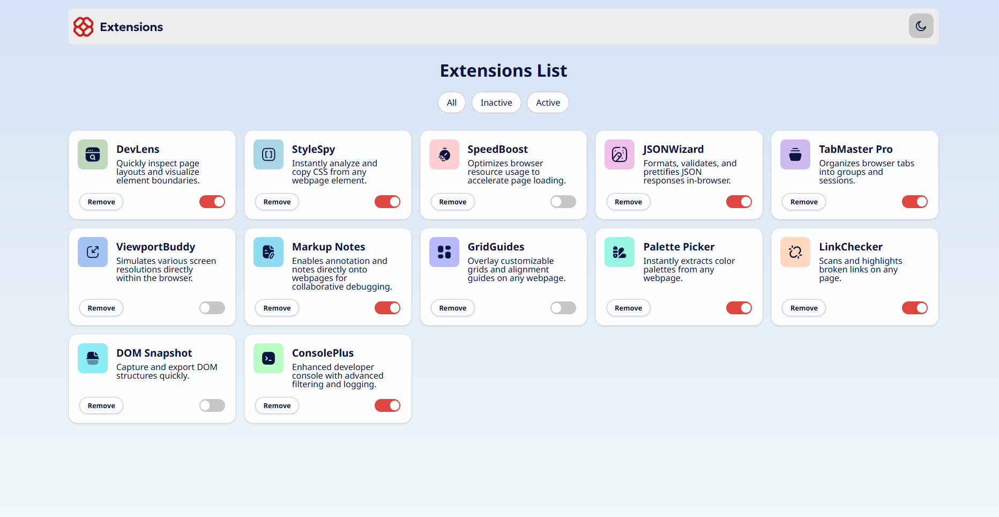
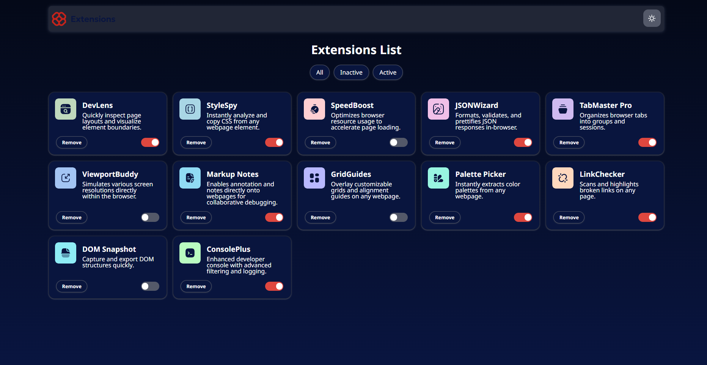
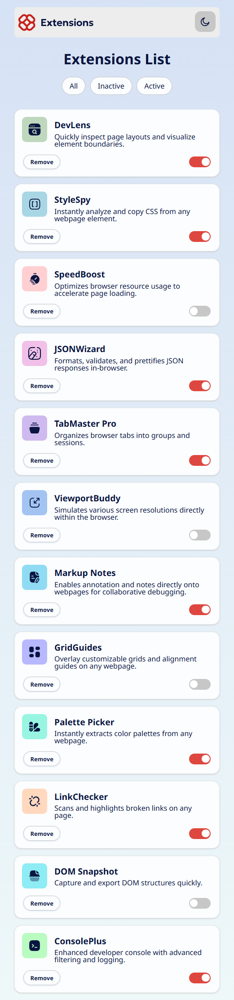
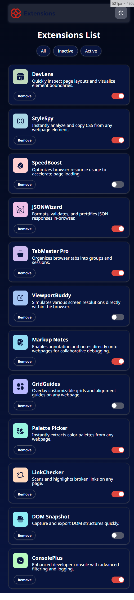

# Frontend Mentor - Browser extensions manager UI solution

This repository contains my solution for the Browser Extensions Manager UI Challenge on Frontend Mentor. The project demonstrates:

## Table of contents

- [Overview](#overview)
  - [The challenge](#the-challenge)
  - [Screenshot](#screenshot)
  - [Links](#links)
- [My process](#my-process)
  - [Built with](#built-with)
  - [What I learned](#what-i-learned)
  - [Continued development](#continued-development)
  - [Useful resources](#useful-resources)
- [Author](#author)
- [Acknowledgments](#acknowledgments)

## Overview

### The challenge

Create a browser extension manager UI where users can:

- Toggle extensions between active and inactive
- Filter the displayed cards by all, active, or inactive
- Remove extensions from the list
- switch the color theme (light/dark), respecting system preference and saving the choice
- View the optimal layout for the interface depending on their device's screen size
- See animations when cards are filtered or removed
- Experience a responsive design with proper hover and focus states

### Screenshot

### Links

- Solution URL: [Solution](https://github.com/Thiagouh/browser-extensions-manager-ui)
- Live Site URL: [Live Site](https://your-username.github.io/browser-extensions-manager-ui)

## My process

### Built with

- Semantic HTML5 markup
- CSS custom properties for theming
- Flexbox & CSS Grid for layout
- Vanilla JavaScript (ES Modules) for logic and interactivity
- Web Storage API (`localStorage`) for persisting theme choice
- `window.matchMedia` for detecting system color-scheme preference
- CSS animations (`@keyframes`) for smooth card transitions

### What I learned

- **Modular JavaScript**: Organized code into ES Modules (`cards`, `filters`, `theme`, `animations`, and `utils`) orchestrated by `initApp()` in `index.js`.
- **DOM Lifecycle**: Used `DOMContentLoaded` to enssure the DOM is ready before querying elements.
- **Data Attributes & CSS Variables**: Leveraged `data-theme` on `<html>` to toggle CSS custom properties for theming.
- **CSS Animations & `animationend`**: Applied `.slide-left` and `.slide-right` classes and used the `animationend` event to remove cards after animation.
- **Media Queries in JS**: Employed `window.matchMedia("(prefers-color-scheme: dark)")` to detect and apply the user's preferred color scheme.

### Continued development

- add **unit tests** with Jest for functions like ``renderFilteredCards` and event handlers.
- Set up **ESLint (Airbnb)** + **Prettier** with Husky hoooks for code quality and consistency.
- Consider migrating to **TypeScript** for stronger typing of `extensionsData` and module

### Useful resources

- [Using the Web Storage API (MDN)](https://developer.mozilla.org/en-US/docs/Web/API/Web_Storage_API) - for ``localStorage` usage
- [matchMedia(MDN)](https://developer.mozilla.org/en-US/docs/Web/API/Window/matchMedia) - detecting system color-scheme preference
- [CSS Custom Properties](https://developer.mozilla.org/en-US/docs/Web/CSS/--*) - theming and variables
- [CSS Animations (MDN)](https://developer.mozilla.org/en-US/docs/Web/CSS/animation) - creating and handling CSS keyframe animations

## Author

- Github - [Thiagouh](https://github.com/Thiagouh)
- Frontend Mentor - [@Thiagouh](https://www.frontendmentor.io/profile/Thiagouh)

## Acknowledgments

- **Frontend Mentor** for the design challenge
- **MDN** for comprehensive web API documentation
